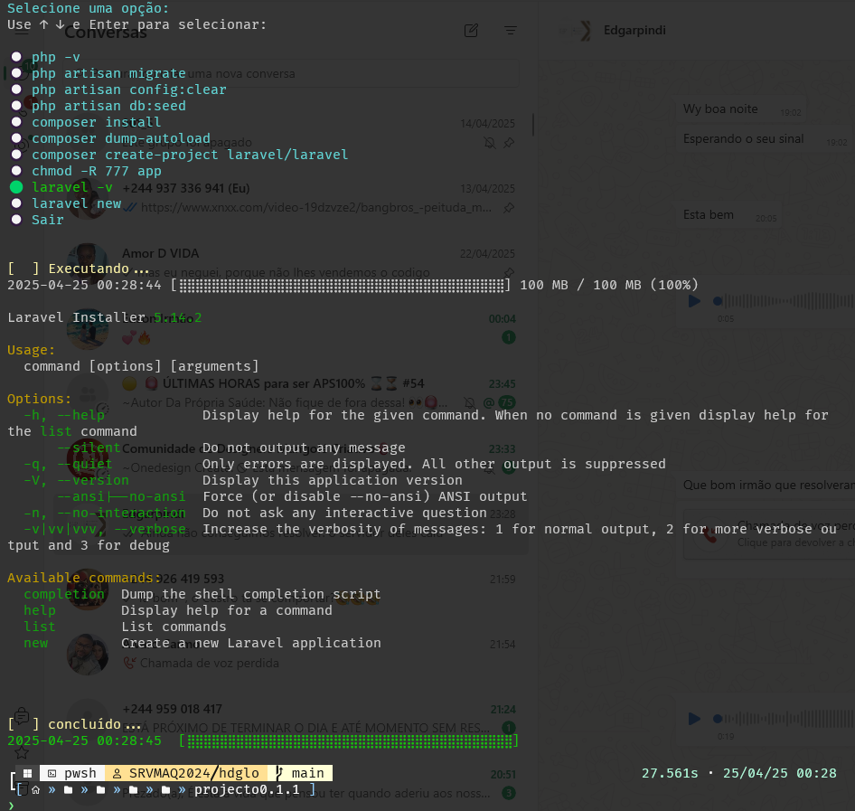

# Munzambi Miguel


| Suporte ao windows 11 : Windows terminal | Suporte ubuntu 22 e 24 ou a dist baseado em derbian |
| ---------------------------------------- | --------------------------------------------------- |
|                                          |                                                     |


| Suporte ao windows 11                                                                                     |                                                                                                                       |
| --------------------------------------------------------------------------------------------------------- | --------------------------------------------------------------------------------------------------------------------- |
|  |  |

### **O projeto tem como objetivo facilitar o uso do Docker com Laravel para iniciantes que desejam configurar um ambiente de desenvolvimento.**

A ideia é proporcionar uma maneira simples e prática de configurar o Docker e o Laravel em uma máquina local, permitindo que desenvolvedores iniciantes possam concentrar-se no desenvolvimento de suas aplicações sem se preocupar com configurações complexas de ambiente.

Com esse projeto, os usuários podem facilmente:

* Rodar containers Docker para isolar o ambiente de desenvolvimento.
* Configurar o Laravel para ser executado dentro do Docker, permitindo que o projeto tenha uma configuração limpa e consistente.
* Facilitar a execução de comandos Artisan e outros comandos do Laravel diretamente dentro do container, sem a necessidade de configurações adicionais complexas.

O projeto foi desenvolvido para ser simples de usar e ideal para desenvolvedores que estão começando com Docker e Laravel. A ideia é proporcionar um ambiente de desenvolvimento rápido e eficiente, sem a necessidade de uma infraestrutura complicada.

> ````
> docker-compose up --build -d
> ````
>
> * [X]  Para configurar o ambiente Windows na raiz do seu projeto, use o comando indicado em cima: Isso permitirá iniciar o ambiente Laravel Developer utilizando Docker. ☝️☝️☝️☝️☝️☝️
>
> Para criar uma novo projecto laravel, basta escrever
>
> ```
> .\bantu laravel new
> ```
>
> Ou Escreva usando o composer
>
> ````
> .\bantu composer create-project
> ````
>
> quasquer comando artisan do laravel podes usar o comando o win.ps1 pa, faz a vez do php artisan na pasta do projecto que será app
>
> ```
> .\bantu pa list
> ```
>
> para ambiente dist linux, ubuntu ou derbian, pode ser usado o lin, em vez de win
>
> ```
>
> ./bantu composer create-project
> ```

**Para usuários do WSL (Windows Subsystem for Linux), como Ubuntu ou Debian:**

Se você deseja acessar arquivos do sistema de arquivos do Windows a partir do terminal WSL, pode montar a unidade do Windows manualmente utilizando o seguinte comando:

```bash
sudo mount -t drvfs C: /mnt/c
```

Esse comando monta a unidade `C:` do Windows no caminho `/mnt/c`, permitindo que você acesse arquivos e pastas como se estivesse em um ambiente Linux padrão.

> 💡 Observação: Em versões mais recentes do WSL, os discos do Windows geralmente já são montados automaticamente em `/mnt`, como `/mnt/c`, `/mnt/d`, etc. No entanto, esse comando pode ser útil caso a montagem automática não ocorra ou tenha sido desativada.

---

Se quiser posso incluir também o uso em scripts ou alias para facilitar a vida no terminal. Deseja?

````
 cd /mnt/c/Users/<username>/Documents/GitHub/Local/docker/projecto0.1.1
 docker-compose --env-file ./containers/Env/.env up --build -d
 docker-compose restart nginx
````

````
.\bantu  # para ober o menu interrativo no ambiente windows ou linux
````


